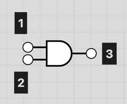

<br>
    <h3 align="center">NanoTekSpice</h3>
    <p align="center">Tek2 OOP project</p>
<details>
    <summary>Table of contents</summary>
    <ol>
        <li>
            <a href="#about-the-project">About the project</a>
            <ul>
                <li><a href="#built-with">Built with</a></li>
            </ul>
        </li>
        <li>
            <a href="#getting-started">Getting started</a>
            <ul>
                <li><a href="#prerequisites">Prerequisites</a></li>
                <li><a href="#installation">Installation</a></li>
            </ul>        
</li>
    </ol>
</details>

## About the project

NanoTekSpice is a 2nd year Epitech Project where we develop a program capable  
of simulating logic circuits in real time. We give circuits as inputs in files  
with the .nts extension, will logic components (AND, OR, XOR...), and the program  
will display a command prompt to display outputs and modify inputs from your  
circuit.

### Prerequisites

* cmake
* g++

### Installation

1. Clone the repo
   ```sh
   git clone git@github.com:martonroux/epitech-nanotekspice.git
   
2. Build the project
   ```sh
   mkdir build && cmake .. && cmake --build .
   ```

3. Run the project
   ```sh
    ./nanotekspice [file.nts]
    ```

## Usage Tutorial

### NTS (Circuit) files

``.nts`` files are the core of our program. It is a file extension created  
specifically for this program, which describes how components of your circuit  
are linked together.  

I believe it is far easier to understand with an example.  

```
.chipsets:
and and_01
not not_01
input in_01
output out

.links:
and_01:1 in_01:1
and_01:2 in_02:1
not_01:1 and_01:3
not_01:2 out:1
```

This is a very simple example of a circuit that creates a NAND gate, from an  
AND gate and a NOT gate. As you can see, there are two parts in this file:  

- ``.chipsets:``: This part is where you declare all the components / gates that  
you are going to use, in this format: ``[type] [name]``. We will go into more  
detail later.
- ``.links:``: This part is where you link all your components / gates depending  
on their pins, in this format: ``[name_1]:[pin_nb_1] [name_2]:[pin_nb_2]``  

#### Types

The type of a component / gate that you write in the ``.chipsets:`` section  
of the file is basically a term that the program can recognize. You have  
different default types available, but you can create more in order to create  
components that depend on other components.


Default types include:  
- and
- or
- xor
- nand
- nor
- not
- input
- output
- clock
- false
- true

The name of a component is, in contrary to the type, unique to each component  
or gate you create. It NEEDS to have a unique name and will throw an error otherwise.  
This is used by the program to differentiate components, but also by you to  
understand what's going on.

#### Pins

AND Gates look like this:  


As you can see, there are 3 pins. Pins nb°1 and nb°2 are input pins, and pin  
nb°3 is an output pin. In the ``.links:`` section of the file, you have to  
say which pin connects to which one. In our example, we connected the AND gate  
to a NOT gate, effectively creating a NAND gate.

You can write the connection of pins in the order you like (there is no left/right  
order). However, you cannot connect an output pin to another output pin, and same  
goes for input pins, as it does not make any sense in a logical circuit. We  
do not handle two-way pins (I/O).

#### Input / Output

There are two gates that are primordial for the program: input and output gates.  
These are basically switches (input) and bulbs (output). They will be used when  
running the program to change input values and receive output values. We will  
talk more about them later, just know that they are vital (not for the program,  
for you).

#### Complex NTS Components

You can create very complex circuits with NTS files. However, dumping everything  
in a single file is quite complex and becomes unreadable very fast. This is why  
you can create your own components that will be used inside of other components.  

In our example above, we created a NAND component with input and output components.  
Because it has the IO components, it is meant to be used alone, not inside of  
other circuits. But we would only have to slightly change the file in order  
to change that:  

```
.chipsets:
and and_01
not not_01
circuit nand

.links:
and_01:1 nand:1
and_01:2 nand:2
not_01:1 and_01:3
not_01:2 nand:3
```

As you can see, we no longer have input and output components. What we have instead  
is a ``ciruit`` component. It is essentially used by the program to understand  
that this circuit is meant to be used inside of other circuits, and that IO  
components from this circuit can be excluded.  

To let the program know which pin corresponds to what, in the ``.links:`` part,  
you have to link the components inside to the circuit like you would for IO  
components. In our example, the and gate has both its inputs connected to the  
nand circuit:  
```
and_01:1 nand:1
and_01:2 nand:2
```

In order to use this component elsewhere in your NTS files, you have to follow  
3 rules:
- The name of the ``circuit`` HAS to be the 'type' of the circuit (like for and, or, xor...)
- The name of the NTS file HAS to be of this format: ``[circuit_name].nts``
- The NTS file HAS to be placed in the ``/circuits`` folder at the root of the repo.

You can find other examples in the ``/circuits`` folder.

### Launching the program

Now comes the fun part. Launch the program using  
``mkdir build && cd build && cmake .. && cmake --build .``  
``./nanotekspice [file.nts]``

An example of nts file is given in the ``/assets`` folder.  
If you compile like the example given just above, you shouldn't have any  
problem with the ``/circuits`` folder being at the root of the repo. However,  
if you do, you can just copy it to the folder where the executable is.

#### Runtime Commands

During runtime, you will have several commands to use the program. Here is a  
list:
- ``display``
- ``simulate``
- ``[input]=[val]``
- ``loop``
- ``debug``

#### Display

The ``display`` command is used to display IO component values at the current  
state.

#### Simulate

The ``simulate`` command will simulate a 'tick' on the circuit. Basically, it  
will pass through the values that you modified earlier.  
Clocks have a special behavior when simulate is called. If the user set the  
clock's value to 0 or 1, the simulate command will change it to 1 or 0 each  
time it is called. If its value is Undefined, it stays so.

#### Input Value Setting

You can set input components values with the ``[input]=[val]`` command. Values  
can be either 0, 1, or U (Undefined). Undefined is the default value. ``[input]``  
is the name of the input component that you want to modify. They can be of types:  
- input
- clock

#### Loop

The Loop command will run ``simulate > display > simulate > display ...`` over  
and over until you stop it with ctrl+D or ctrl+C.

#### Debug

This command displays input pin values of nested circuits. So for example, if  
your circuit has a nand circuit nested inside, then the debug command will show  
the value that is stored in each input pin of the nand component. This command  
works recursively on all nested circuits.

### And now, just have fun!

There isn't much more to explain. There are lots of available components in  
the ``/circuits`` folder. Feel free to use them and add more!
